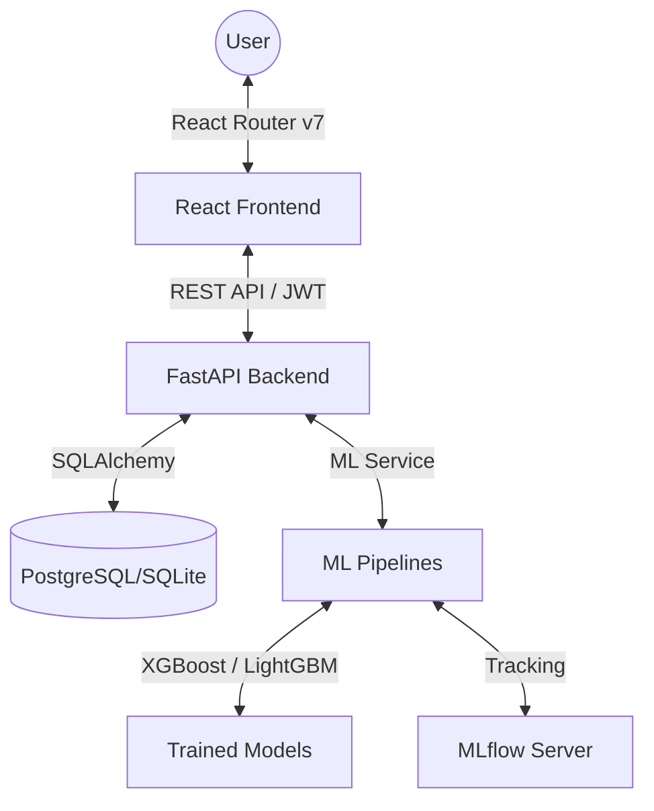

# 🌐 NeuroSight
### Advanced Predictive Analytics & Neural Machine Learning Dashboard

**NeuroSight** is a high-performance SaaS platform built for complex data visualization, predictive forecasting, and advanced machine learning pipeline management. Designed with an **Electric Dark** aesthetic, it provides a seamless bridge between raw data and actionable intelligence.

---

[Explore Features](#🚀-key-features) • [Tech Stack](#🛠️-tech-stack) • [Installation](#📦-getting-started) • [Architecture](#🏗️-architecture)

## 🚀 Key Features

- 🧠 **Predictive Forecasting**: Advanced time-series analysis using LightGBM and XGBoost for market and sales trends.
- ⚡ **Electric Dark UI**: A high-tech, responsive dashboard built with Tailwind v4 and Radix UI components.
- 🔄 **Motion Transitions**: Sophisticated 3D-layered animations and parallax effects powered by Framer Motion.
- 📊 **Dynamic Analytics**: Real-time data visualization with Recharts, including RFMQ and RFQU specialized analysis.
- 🛠️ **Admin Control Center**: Comprehensive user and system management with dynamic configuration toggles.
- 🔐 **Secure ML Ops**: Integrated MLflow tracking for model versioning and experimentation metadata.

---

## 🛠️ Tech Stack

### Frontend Ecosystem
- **Core**: React 18, Vite, TypeScript
- **Styling**: Tailwind CSS v4, Lucide Icons
- **Animation**: Framer Motion, Motion One
- **Components**: Radix UI, Shadcn/UI primitives
- **Routing**: React Router v7

### Backend & AI
- **API**: FastAPI (Python 3.10+)
- **Database**: PostgreSQL / SQLite with SQLAlchemy ORM
- **Migration**: Alembic
- **ML Frameworks**: Scikit-Learn, XGBoost, LightGBM
- **Experiment Tracking**: MLflow

---

## 🏗️ Architecture

---

## 📦 Getting Started

### 🛠️ Installation

#### Backend Setup
1. Navigate to the backend directory: `cd backend`
2. Create a virtual environment: `python -m venv .venv`
3. Activate environment: `.venv\Scripts\activate` (Windows) or `source .venv/bin/activate` (Linux)
4. Install dependencies: `pip install -r requirements.txt`
5. Run the server: `uvicorn app.main:app --reload`

#### Frontend Setup
1. Navigate to the root directory.
2. Install dependencies: `npm install`
3. Start development server: `npm run dev`

---

## ☁️ Cloud Deployment

### Backend on Railway
1. Create a new Railway project and add a service from this repo.
2. Set service root directory to `backend`.
3. Railway will use `backend/Procfile` to start the app on `$PORT`.
4. Add environment variables from `backend/.env.example`.
5. For production, set:
    - `DATABASE_URL` to Railway PostgreSQL connection URL.
    - `CORS_ORIGINS` to include your Vercel domain (JSON array format).
6. Deploy and copy your Railway public URL (example: `https://your-api.up.railway.app`).

### Frontend on Vercel
1. Import this repository in Vercel.
2. Keep project root as repository root.
3. Build command: `npm run build`.
4. Output directory: `dist`.
5. Add environment variable:
    - `VITE_API_BASE_URL=https://your-api.up.railway.app/api/v1`
6. Deploy.

`vercel.json` is included so client-side routes are rewritten to `index.html`.

---

## 📄 License & Attributions

This project is built with contributions from several open-source ecosystems:
- **UI Architecture**: Based on components from [shadcn/ui](https://ui.shadcn.com/).
- **Imagery**: Photos from [Unsplash](https://unsplash.com).
- **Icons**: [Lucide-React](https://lucide.dev).

Developed by **Kawshik Khan**.

---

    Built with 💙 and 🧠 for the next generation of data-driven applications.

