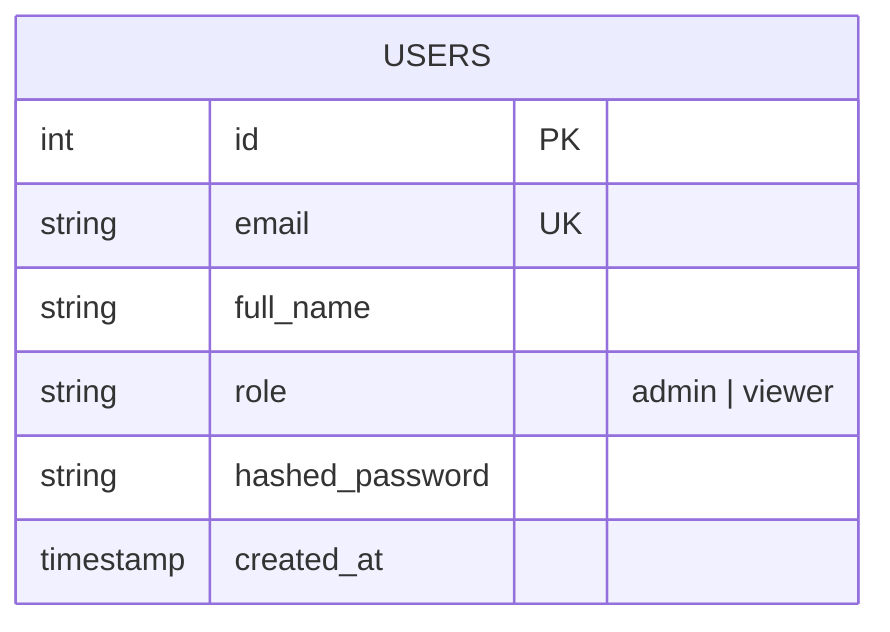
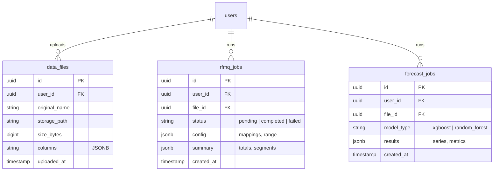

# 🗄️ NeuroSight Database Design (Supabase)

This document outlines the current and proposed database schema for the NeuroSight platform, optimized for Supabase (PostgreSQL).

## 1. Current Schema (Phase 1)
Currently, the system uses a minimal schema focused on Authentication and User Management.



---

## 2. Proposed Production Schema (Phase 2)
To support advanced features like per-user uploads, saved analyses, and forecasting history, the following schema is recommended.

### Core Modules

#### A. Data Management
Instead of relying on a `data_index.json` in storage, we move to a `data_files` table for fast querying.

#### B. RFMQ Analysis
Persistence for RFMQ (Recency, Frequency, Monetary, Quantity) jobs and their resulting segments.

#### C. Forecasting
Stores the configuration and high-level results of ML forecasts.



---

## 3. Detailed Table Definitions

### `users` (Existing, synced with Supabase Auth)
| Column | Type | Description |
| :--- | :--- | :--- |
| `id` | SERIAL / UUID | Primary Key |
| `email` | TEXT | Unique. Syncs with Auth email. |
| `full_name` | TEXT | Display name. |
| `role` | TEXT | Default 'viewer'. |
| `created_at` | TIMESTAMPTZ | Automatic timestamp. |

### `data_files` (Proposed)
| Column | Type | Description |
| :--- | :--- | :--- |
| `id` | UUID | Primary Key. |
| `user_id` | UUID | Foreign Key to `users.id`. |
| `storage_name` | TEXT | The UUID name in Supabase Storage. |
| `display_name` | TEXT | The original filename (e.g., 'sales_2024.csv'). |
| `metadata` | JSONB | Column names, row counts, data types. |

### `analysis_history` (Proposed)
| Column | Type | Description |
| :--- | :--- | :--- |
| `id` | UUID | Primary Key. |
| `user_id` | UUID | Foreign Key to `users.id`. |
| `type` | TEXT | 'rfmq' or 'forecast'. |
| `input_config` | JSONB | Parameters used for the run. |
| `result_data` | JSONB | The actual numbers/charts data. |

---

## 4. Implementation Strategy
1.  **Alembic Migrations**: Create new auto-generated migrations for the Python models.
2.  **Service Refactoring**: Update `DataStorageService` to write to the `data_files` table upon successful Supabase Storage upload.
3.  **RLS (Row Level Security)**: Enable Supabase RLS so users can only see their own files and analysis results:
    ```sql
    ALTER TABLE data_files ENABLE ROW LEVEL SECURITY;
    CREATE POLICY "Users can only view their own files" ON data_files
    FOR SELECT USING (auth.uid() = user_id);
    ```
